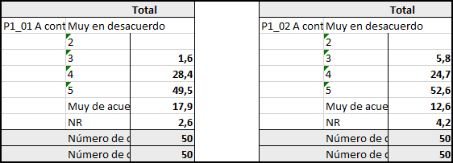
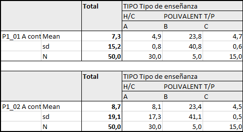

# Automatización de tabulaciones de variables (de frecuencia, contingencia y diferencia de medias)

## Tablas de frecuencia/contingencia

Gran parte del trabajo que realiza el analista es manipular y presentar datos cualitativos. Debido a esta frecuencia en el uso de estas técnicas, es mucho más eficiente contar con una herramienta (en este caso un script) que nos permita automatizar el proceso de generación de tablas.

Para lograr generar estas tablas realizaremos los siguientes pasos:

### **1. Cargar nuestra BBDD**
```{r librerias y cargar BBDD, warning=FALSE, message=FALSE}
# cargamos nuestra bbdd en formato .sav con la librería haven
library(haven)

# Definir directorio propio (quitar comentario)
# getwd()

# IMPORTAR BBDD
director <- read_sav("BBDD/220244 BDD_director_escalas.sav")  # cargar base
summary(director$Pond_Nac)      # resumen estadístico del ponderador (si aplica)

```

### **2. Creamos un banner**

Se debe crear el objeto Banner, con las variables de cruce a considerar y la función total(). Con el argumento "tab_weight" se pone la variable ponderador.

```{r message=FALSE}
# cargamos el tidyverse, pues utilizaremos el pipeline ( %>% )
library(tidyverse)

# cargamos la libraría expss
library(expss)


# duplicamos la base original
BBDD <- director

# banner
banner_1 <- BBDD %>%     # base
  tab_cols(total()) %>%  # variables que queremos como columnas***
  tab_weight(weight = Pond_Nac)  # agregamos el ponderador de nuestra base

# *** tenemos la posibilidad de agregar otras variables de interés.
# Un ejemplo puede ser incluir la variable "sexo", u otra variable (ahora solo pediremos el total)
# Ejemplo:
# banner_1 <- BBDD %>%                 # base
# tab_cols(total(c(sexo, comuna)) %>%  # variables que queremos como columnas
# tab_weight(weight = Pond_Nac)     # agregamos el ponderador de nuestra base


# Si no hay ponderador, se puede usar tambien la función "calc". 
# Hace lo mismo que la otra, pero sin ponderar.
# (quitar comentari en caso de utilizar)
#banner_1 <- calc(total(), estrato_ciudad, V_1, V_2)) 
```

### **3. Una vez creamos nuestro objeto banner, debemos crear una función capaz de crear las diferencias proporcionales**

```{r}
# esta función se guardará en nuestro enviroment con el nombre de "tab_pct_sig"
tab_pct_sig = . %>% tab_stat_cpct(                 # funcion
  total_statistic = c("w_cases",                   # total de casos ponderados
                      "u_cases"),                  # total de casos no poderados
  total_label = c("Número de casos ponderados",    # etiqueta de "w_cases"
                  "Número de casos no ponderados") # etiqueta de "u_cases"
  ) %>% 
  tab_last_sig_cpct(bonferroni = TRUE)             # TRUE=calcula las 
                                                   # diferencias proporcionales
```

### **4. Creación de secciones (Recomendado)**

Cuando necesitamos generar múltiples tablas es mejor separar la base de datos por secciones, pues calcular múltiples tablas de diversas variables puede hacer que el computador se congele. 

Para este caso crearemos una sección que contiene veintiún preguntas escalares, la cual guardaremos en formato lista. Si lo deseamos, podemos guardar esa lista en otro objeto particular que haga referencia a ella.

```{r}
# creamos nuestra seccion con las preguntas que la componen
# para este caso seleccionamos 21 preguntas
seccion_1_prop <- BBDD %>% 
  select(ConfDir_P1:ConfProc_P21)

# corroboramos que la seccion se componga con las variables requeridas
names(seccion_1_prop)


# creamos una lista que contiene los elementos solicitados ()
list_table_seccion1_banner1 = lapply(seccion_1_prop, function(variable) {
  banner_1 %>% 
    tab_cells(variable) %>%
    tab_pct_sig %>%
    tab_pivot()
})
# Funcion "lapply": aplica una funcion especifica a cada elemento
#  del objeto que se le indique. Para este caso, aplicamos los tabulados
#   de frecuencias a toda la seccion_1_prop, arrojando un objeto en formato lista


#Si queremos podemos guardar todas las tablas dentro de un objeto
#ConfDir_P1 <- list_table_seccion1_banner1$ConfDir_P1
### OJO: Esta opcion hace que se pierdan las etiquetas ###

# codigo para obtener un ejemplo de nuestras tablas (para P1 en este caso)
print(list_table_seccion1_banner1$ConfDir_P1)

```

---

## Tablas de diferencias de medias

Así como buscamos crear tablas de frecuencias/contingencias, también necesitaremos crear tablas que contengan datos cuantitativos. Para este caso haremos tablas con diferencias de medias.

### **1. Creamos un banner**

```{r}
# creamos un banner que contenga nuestra informacion

# duplicamos la base original
BBDD <- director

# banner
banner_2 <- BBDD %>%             # base
  tab_cols(total(), TIPO) %>%    # variables que queremos como columnas***
  tab_weight(weight = Pond_Nac)  # agregamos el ponderador de nuestra base

# *** tenemos la posibilidad de agregar otras variables de interés.
#  Un ejemplo puede ser incluir la variable "sexo", u otra variable
# Ejemplo:
# banner_1 <- BBDD %>%                 # base
#   tab_cols(total(c(sexo, comuna)) %>%  # variables que queremos como columnas
#   tab_weight(weight = Pond_Nac)     # agregamos el ponderador de nuestra base


# Si no hay ponderador, se puede usar tambien la función "calc". 
# Hace lo mismo que la otra, pero sin ponderar
# banner_1 <- calc(total(), estrato_ciudad, V_1, V_2)) 
```

### **2. Creamos una función que nos permita calcular las diferencias de medias**

```{r}
# esta función se guardará en nuestro enviroment con el nombre de "tab_means_sig"
tab_means_sig = . %>% tab_stat_mean_sd_n(   # funcion
  labels = c("Mean",                        # etiquetas que tendran las filas.
             "sd",                          # Siguen el mismo orden que la funcion:
             "N")) %>%                      # mean, sd, n
  tab_last_sig_means(bonferroni = TRUE)     # TRUE=calcula las diferencias de media
```

### **3. Creación de secciones (Recomendado)**

Cuando necesitamos generar múltiples tablas es mejor separar la base de datos por secciones, pues calcular múltiples tablas de diversas variables puede hacer que el computador se congele. 

Para este caso crearemos una sección que contiene veintiún preguntas escalares, la cual guardaremos en formato lista. Si lo deseamos, podemos guardar esa lista en otro objeto particular que haga referencia a ella.

```{r}
# creamos nuestra seccion con las preguntas que la componen
seccion_1_medias <- BBDD %>% 
  select(ConfDir_P1:ConfProc_P21)

# corroboramos que la seccion se componga con las variables requeridas
names(seccion_1_medias) 
                       


# creamos una lista que contiene los elementos solicitados ()
list_table_seccion1_banner2 = lapply(seccion_1_medias, function(variable) {
  banner_2 %>% 
    tab_cells(variable) %>%
    tab_means_sig() %>%
    tab_pivot()
})
# Funcion "lapply": aplica una operacion especifica a cada elemento
#  del objeto que se le indique. Para este caso, aplicamos los tabulados
#   de media a toda la seccion_1_medias, arrojando un objeto en formato lista


#Si queremos podemos guardar todas las tablas dentro de un objeto
#ConfDir_P1 <- list_table_seccion1_banner2$ConfDir_P1
# Esta opcion hace que se pierdan las etiquetas

# codigo para obtener un ejemplo de nuestras tablas (para P1 en este caso)
print(list_table_seccion1_banner2$ConfDir_P1)

```

---

## Exportar tablas a excel

Una vez tengamos los cálculos de nuestras tablas, necesitaremos exportarlas para poder presentarlas de buena manera. Contamos con dos alternativas para esto: 1) exportarlas de manera independiente o 2) exportar ambas tablas (de frecuencias y de diferencias de medias) en un solo archivo excel.

### 1. Independientes: porcentajes

**a) Construir hoja de cálculo en R**

```{r}
# para construir nuestro hoja de calculo de R utilizaremos la libreria "openxlsx"
library(openxlsx)

# crear excel en R
banner_prop = createWorkbook()  # generamos documento en blanco.
sh1 = addWorksheet(             # generamos una hoja para las diferencias de
  banner_prop, "Proporciones")  # proporciones
```

**b) Introducir elementos al objeto woorkbook**

```{r}
# para introducir elementos dentro de nuesto objeto excel generado utilizamos la libreria "expss"
library(expss)

xl_write(list_table_seccion1_banner1,   # lista con nuestros resultados la seccion 1
         banner_prop,                   # nuestro objeto workbook creado anteriormente
         sh1,                           # hoja especifica para proporciones
         col_symbols_to_remove = "#",   # eilimanr # de las columnas
         row_symbols_to_remove = "#",   # eliminar # de las filas
         other_col_labels_formats = list("#" = createStyle(textDecoration = "bold")))
```

**c) Exportar objeto workbook a excel**

```{r}
# exportar todo lo introducido en banner_prop a excel

### OJO: quitar comentarios para usar ###
# saveWorkbook(banner_prop,                        # objeto a exportar
#              "Diferencias proporcionales.xlsx",  # nombre de la hoja
#              overwrite = TRUE)

```




### 2. Independientes: diferencia de medias

**a) Construir hoja de cálculo en R**

```{r}
# para construir nuestro hoja de calculo de R utilizaremos la libreria "openxlsx"
library(openxlsx)

# crear excel en R
banner_medias = createWorkbook()           # generamos documento en blanco
sh2 = addWorksheet(banner_medias,          # generamos una hoja para
                   "Diferencias de media") # insertar las medias

```

**b) Introducir elementos al objeto woorkbook**

```{r message=FALSE}
# para introducir elementos dentro de nuesto objeto excel generado utilizamos la libreria "expss"
library(expss)

xl_write(list_table_seccion1_banner2,  # lista con nuestros resultados la seccion 1
         banner_medias,             # nuestro objeto workbook creado anteriormente
         sh1,                             # hoja especifica para docentes
         col_symbols_to_remove = "#",     # eiliminar # de las columnas
         row_symbols_to_remove = "#",     # eliminar # de las filas
         other_col_labels_formats = list("#" = createStyle(textDecoration = "bold")))

```

**c) Exportar objeto workbook a excel**

```{r}
# # exportar todo lo introducido en banner_prop a excel

### OJO: quitar comentarios para usar ###
# saveWorkbook(banner_medias,               # objeto a exportar
#              "Diferencias de medias.xlsx",  # nombre de la hoja
#              overwrite = TRUE)
```




### 3. En conjunto: porcentaje y dif de medias en un solo archivo 

Para exportar un solo archivo excel debemos:

**a) Crear banner con sus hojas**

```{r}
# crear banner
banner_full <- createWorkbook()  # generamos documento en blanco
sh3 <- addWorksheet(banner_full, # generamos una hoja para insertar las proporciones
                   "Diferencias proporcionales")
sh4 <- addWorksheet(banner_full,
                   "Diferencias de medias")  # generamos una hoja para insertar las medias
```

**b) Escribir información dentro del objeto workbook**

```{r message=FALSE}
# para introducir elementos dentro de nuesto objeto excel generado 
# utilizamos la libreria "expss"
library(expss)

xl_write(list_table_seccion1_banner2,          # lista con nuestros resultados la seccion 1
         banner_full,                          # nuestro objeto workbook creado anteriormente
         sh4,                                  # hoja especifica para medias
         col_symbols_to_remove = "#",          # eilimanr # de las columnas
         row_symbols_to_remove = "#",          # eliminar # de las filas
         other_col_labels_formats = list("#" = createStyle(textDecoration = "bold")))

xl_write(list_table_seccion1_banner1,          # lista con nuestros resultados la seccion 1
         banner_full,                          # nuestro objeto workbook creado anteriormente
         sh3,                                  # hoja especifica para proporciones
         col_symbols_to_remove = "#",          # eilimanr # de las columnas
         row_symbols_to_remove = "#",          # eliminar # de las filas
         other_col_labels_formats = list("#" = createStyle(textDecoration = "bold")))

```

**c) Exportar archivo excel**

```{r}
# exportar todo lo introducido en banner_prop a excel

### OJO: quitar comentarios para usar ###
# saveWorkbook(banner_full,                       # objeto a exportar
#              "Diferencias prop y medias.xlsx",  # nombre de la hoja
#              overwrite = TRUE)

```

**Al exportar nuestro archivo, nos encontraremos dos hojas dentro del mismo archivo excel, una para cada sheet que hayamos agregado en nuestro código de R (en este caso sh3 y sh4 presentes en el código anterior)**


