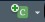
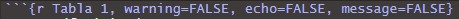
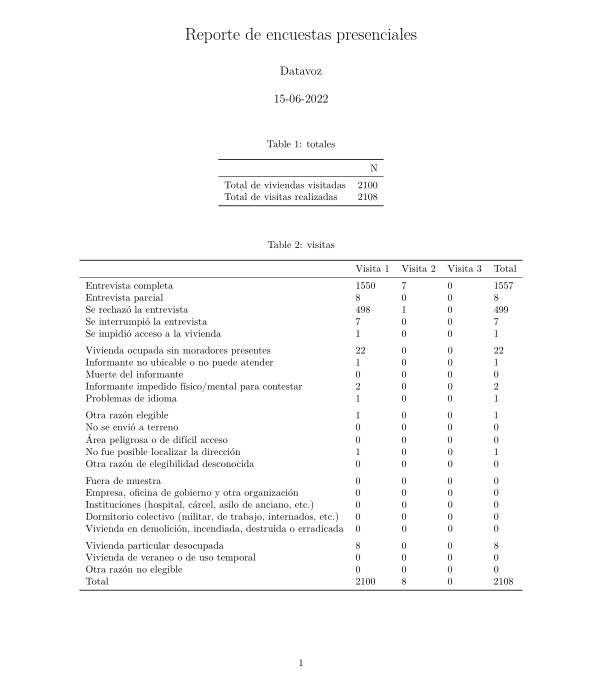
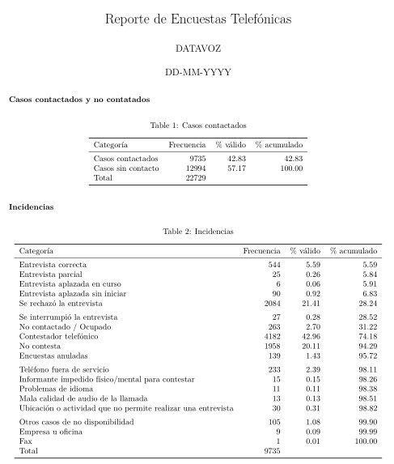

# Introducción a RMarkdown y creación de reportes automáticos

## ¿Qué es RMarkdown (RMD)?

En términos sencillos RMarkdown es un procesador de texto que ofrece además la posibilidad de incluir trozos de código desde R (u otros formatos). El principal beneficio de esta herramienta es que permite trabajar en un sólo documento tanto la redacción del contenido narrativo de reportes de investigación, como también la construcción y presentación formal de resultados de análisis estadísticos

**Elementos necesarios para ejecución de RMarkdown: procedimientos de instalación**

| Elemento    |  Procedimiento de instalación | Código para instalación |
|:------------|:-----------------------------:|:-----------------------:|
|**RMarkdown**|No es necesario ningún procedimiento adicional a la instalación de R y RStudio pues viene instalado con este último. | No aplica |
|**Knitr**    |Debe instalarse como cualquier otro paquete de R, asegurando su disponiblidad para ser utilizado por RMarkdown al compilar documentos.| `install.packages(“knitr”)` |
|**Pandoc**   | No es necesario ningún procedimiento adicional a la instalación de R y RStudio pues viene instalado con este último. | No aplica |
|**LaTex**    | Debe descargarse como un paquete de R. Para asegurar su disponibilidad para ser utilizado por RMarkdown al compilar documentos, debe instalarse con un comando adicional. | `install.packages(“tinytex”)` `tinytex::install_tinytex()` |

**En síntesis: antes de proceder a la compilación de un documento RMarkdown, debemos asegurar la instalación de estos componentes en nuestros computadores.**

*Contenido extraído de [RStudio para Estadística Descriptiva en Ciencias Sociales](https://bookdown.org/gboccardo/manual-ED-UCH/). Para más información acceder al link*

## Sintaxis básica de escritura

RMarkdown, como su nombre bien nos dice, utiliza el lenguaje de marcado Markdown. En este sentido, la escritura de los informes y reportes deben ser construidos con la estructura de este procesamiento de texto, es decir, bajo una colección simple de convenciones para dar formato a archivos de texto plano. Markdown está diseñado para ser fácil de leer y fácil de escribir. Es también muy fácil de aprender. La siguiente guía muestra cómo usar el Markdown de Pandoc, una versión ligeramente extendida de Markdown que R Markdown comprende.

```{r eval=FALSE}
Formato de texto
------------------------------------------------------------

*cursiva*   o _cursiva_
**negrita**   __negrita__
`code`
superíndice^2^ y subíndice~2~

Encabezados
------------------------------------------------------------

# Encabezado de primer nivel

## Encabezado de segundo nivel

### Encabezado de tercer nivel

Listas
------------------------------------------------------------

*   Elemento 1 en lista no enumerada

*   Elemento 2

    * Elemento 2a

    * Elemento 2b

1.  Elemento 1 en lista enumerada

1.  Elemento 2. La numeración se incrementa automáticamente en el output.

Enlaces e imágenes
------------------------------------------------------------

<http://ejemplo.com>

[texto del enlace](http://ejemplo.com)


Tablas 
------------------------------------------------------------

| Primer encabezado     | Segundo encabezado   |
|---------------------- | ---------------------|
| Contenido de la celda | Contenido de la celda|
| Contenido de la celda | Contenido de la celda|
```

Para más información acceder al siguiente [link](https://rpubs.com/CarolinaMolinare/844849).

## Creación y opciones los chunks

Una ventaja que tenemos al trabajar con RMarkdown es que podemos insertar códigos, y los resultados de estos, directamente a nuestro documento final. Para lograr lo anterior utilizamos los chunks, que son bloques de código que se introducen en nuestro script RMD. Para crearlos tenemos dos opciones:

1. Pinchar el icono  en la parte superior de la ventana de edición de Rstudio.

2. Pulsar Alt-Ctrl-I (en Windows y Linux) o Alt-Cmd-I en Mac


### Opciones de los chunks:

Los chunks en RMD pueden tener diversas opciones para la visualización o ejecución de los códigos:

* `eval = FALSE` evita que el código sea evaluado. (Y, obviamente, si el código no es ejecutado no se generaran resultados). Esto es útil para mostrar códigos de ejemplo, o para deshabilitar un gran bloque de código sin comentar cada línea.

* `include = FALSE` ejecuta el código, pero no muestra el código o los resultados en el documento final. Usa esto para código de configuración que no quieres que abarrote tu reporte.

* `echo = FALSE` evita que se vea el código, pero sí muestra los resultados en el archivo final. Utiliza esto cuando quieres escribir reportes enfocados a personas que no quieren ver el código subyacente de R.

* `message = FALSE` o `warning = FALSE` evita que aparezcan mensajes o advertencias en el archivo final.

* `results = 'hide'` oculta el output impreso; fig.show = 'hide' oculta gráficos.

* `error = TRUE` causa que el render continúe incluso si el código devuelve un error. Esto es algo que raramente quieres incluir en la versión final de tu reporte, pero puede ser muy útil si necesitas depurar exactamente qué ocurre dentro de tu .Rmd. Es también útil si estás enseñando R y quieres incluir deliberadamente un error. Por defecto, error = FALSE provoca que el knitting falle si hay incluso un error en el documento

Para más información sobre las opciones que se pueden agregar a los chunks visitar el [siguiente link](https://rmarkdown.rstudio.com/lesson-3.html)

**Las opciones deben ingresarse al incio del chunk y separadas por comas, tal como se muestra en la siguiente imagen:** 

---

## Reportes automáticos

Como mencionamos anteriormente, la ventaja de RMarkdown es poder utilizar código y texto plano a la vez. En tal sentido, trabajar con este formato nos ofrece una gran ventaja al momento de generar informes de forma rápida y sencilla.

Los siguientes apartados contemplan la construcción de dos reportes automáticos que se realizan constantemente en D&A. Ambos refieren al monitoreo de las encuestas presenciales y las encuestas telefónicas.

### Reporte encuestas presenciales

Esta sección expone la manera y los elementos necesarios para crear un reporte automático del avance de los terrenos en las encuestas presenciales. Sin embargo, antes de generar el reporte debemos realizar modificaciones a la BBDD que contiende los datos de las encuestas presenciales.

Estas modificaciones se encuentran almacenadas en dos scripts: `BBDD_Visitas` y `BBDD_Viviendas`. Dentro del reporte utilizamos la función `source()` para ejecutarlos automáticamente, de esta manera obtenemos dos nuevos objetos (los que utilizaremos para crear el reporte): 

a. `df_viviendas`: BBDD que contiene la información final según la última dirección utilizada.

b. `df_visitas`: BBDD que contiene la información final en función de la cantidad de visitas realizadas a cada dirección.

**Entonces, necesitamos los siguientes scripts para la construcción del reporte automático**

1) `Reporte_enc_presencial`: script automatizado para generar el reporte.
2) `BBDD_Vivendas`: script que crea una BBDD con la selección final de dirección.
3) `BBDD_Visitas`: scripts que crea una BBDD con la cantidad de visitas que se debieron realizar para lograr la encuesta en la dirección final.

**En este sentido, es imperante descargar los archivos que se presentan a continuación y almacenarlos en la carpeta de nuestro proyecto de R**.

**Links de descarga**

| **Elemento**                                                                                       |
|:--------------------------------------------------------------------------------------------------:|
|[Script para encuesta presencial](https://drive.google.com/file/d/1bZwiTVX-SPxWfVgRd3FlJG6xXc0Zcyd0/view?usp=sharing)                                                            |
|[BBDD_Visitas](https://drive.google.com/file/d/172zEFjG-WReAKSEKIGi-he3vekjaoDnc/view?usp=sharing)  |
|[BBDD_Viviendas](https://drive.google.com/file/d/17LEX0yD2vBO4cBViRYiQzjSrpQUKLIbK/view?usp=sharing)|


El script si bien se encuentra automatizado y comentado con el paso a paso, aquí revisaremos los aspectos más importantes para lograr ejecutar el procedimiento.

1. Descargar los archivos anteriores y guardarlos en nuestra carpeta del proyecto.

2. Abrir el Script automatizado y cambiar los elementos atingentes: título, fecha, autor.

3. Cargar BBDD con información de las encuestas presenciales a R. Aquí utilizamos el segundo chunk y debemos ingresar el nombre de nuestro archivo.

4. Asegurarnos que el los scripts `BBDD_Vivendas` y `BBDD_Visitas` se encuentren especificados con las rutas correspondientes.

5. Una vez tengamos listos los pasos anteriores, presionamos el botón . Esto nos entregará el reporte en formato PDF dentro de la carpeta de nuestro proyecto de R.

Algo más o menos así: ejemplo de reporte de encuesta presencial.

<center>

</center>

---

### Reporte encuestas telefónicas

Lo mismo con los terrenos telefónicos, contamos con un script que nos genera un reporte, sin embargo, este no es tan automático como nosotros desearíamos, pues existen ciertas categorías no estandarizadas que generan conflictos al momento de su construcción. Aquí explicaremos en breve la manera de corregir estas deficiencias, pues el script se presenta con un paso a paso para lograr salvaguardar tal disparidad en la codificación.

Para ello debemos **descargar el siguiente archivo**

| **Elemento**                                                                                       |
|:--------------------------------------------------------------------------------------------------:|
|[Script para encuestas telefónicas](https://drive.google.com/file/d/1CBGIEs95P9ueSe-e4gb_NNUB841sopqp/view?usp=sharing)|

1. El primer paso es cargar nuestra data a R, respetando su ruta y su nombre.

2. Luego, ejecutamos el chunk de la tabla 1. Esto nos servirá para confirmar que hayamos recodificado de buena manera las categorías no estandarizadas.

3. Lo más importante es ejecutar el punto 1, 2 y 3 del apartado de "Incidencias". Estos nos permitirán estandarizar las categorías.

    3.1 El paso n°1 nos identifica aquellas categorías faltantes de recodificar. Los elementos que nos entregue `setdiff(bd, estand)` debemos recodificarlos en alguna de las categorías presentes en el objeto `cat_estand`.
    
    3.2 El paso n°2 consiste en la recodificación. Aquí debemos incluir todas las categorías que nos arrojó el paso 1 (exluyendo la categoría "NA").
    
    3.3 El paso n°3 consiste en asignar el orden de las categorías para luego hacer el cálculo automático de la tabla.
    
    3.4 Para comprobar que hayamos hecho bien estos pasos debemos ir a la tabla 1 y comparar la frecuencia de la categoría "Casos contactados" con el total que nos indica la tabla 2. Si son iguales, no nos faltan categorías por recodificar, si no son equivalentes, volvemos a los pasos anteriores y nos sercioramos de haber incluido todas las categorías (es común equivocarse en tíldes, espacios, mayúsculas, etc).

4. Una vez corroborado que la recodificación haya sido un éxito ejecutamos el resto del sript con 


Esto nos entregará algo más o menos así: ejemplo de reporte de encuestas telefónicas.

<center>



</center>


