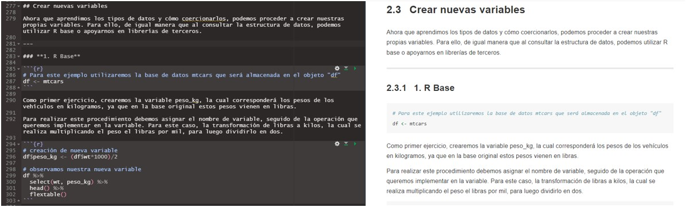

--- 
title: "Bookdown Dirección y Análisis"
site: bookdown::bookdown_site
---

# Introducción

El siguiente material corresponde a un Bookdown, un formato de libro electrónico creado mediante la combinación del lenguaje de programación R y el lenguaje de marcado Markdown. La finalidad de este proyecto es recopilar funciones de utilidad relacionadas al uso cotidiano de R, incluyendo códigos que sirvan como ejemplo para la recodificación de variables, selección de casos, aplicación de filtros, entre otros. Tal recopilación pretende transformarse en un insumo para el equipo de analistas de D&A, agilizando la búsqueda de información en relación al manejo de R para el análisis de datos.

A su vez, el proyecto une diversas labores que se realizan de forma regular dentro de Datavoz. Dentro de estas encontramos la creación de tablas automáticas que se utilizan regularmente en los proyectos, la creación de reportes de terreno para las encuestas telefónicas y presenciales, mallas de validación, creación de ponderadores por ranking, etc.

El presente producto es el inicio del proyecto. Su objetivo final es que este se convierta en un **libro de construcción colaborativa** entre todos y todas las analistas de Datavoz, donde puedan agregar nuevas funciones que consideren de utilidad al momento de enfrentarse a las bases de datos y se agreguen otros procesos que se realicen con frecuencia.

## ¿Cómo aportar al bookdown?

La principal manera de agregar contenido al bookdown es mediante la creación de nuevos capítulos, o nuevos subcapítulos que complementen aquellos ya hechos (como, por ejemplo, agregar nuevas funciones al capítulo de "Procesamiento de bases de datos"). 

Hacer esto se torna sencillo gracias a RMarkdown, pues solo debemos crear un nuevo archivo .RMD y comenzar a explicar aquello que queremos documentar. La escritura del capítulo y la inserción de código siguen la misma lógica que la creación de reportes automáticos en R (véase capítulo 7 del presente documento).

**Pasos para crear un nuevo capítulo o subcapítulo**

1. Crear un nuevo archivo RMD. Para esto presionamos en "new file" y luego "R Markdown"

2. Al presionar en "R Markdown" se nos abrirá una nueva ventana donde debemos definir el título y el formato de salida. Estos elementos no son necesarios, pues los eliminaremos una vez se cree el archivo. En este sentido, solo presionamos "ok" para crear el nuevo RMD.

3. Cuando creemos el archivo, seleccionamos todo lo que está en su interior y lo borramos, quedando un documento limpio para comenzar a ser trabajado.

4. Luego de limpiar el archivo, podemos comenzar a escribir utilizado Markdown, tal como se muestra en la imagen a continuación.

5. Una vez lo tengamos listo, con todas aquellas cosas que queramos agregar, guardamos el archivo, le asignamos un nombre y se lo enviamos a Joao Acharán, quien será el encargado de compilar los capítulos, subirlos a github y actualizar el documento el línea.

**Este es un ejemplo de uno de los capítulos realizados**

* _Proyecto enmarcado en práctica profesional para optar al título profesional de Sociólogo por la Universidad Diego Portales._

* _Agradezco la oportunidad y la gran hospitalidad que se me han brindado estos meses, Jonatan Salazar._

